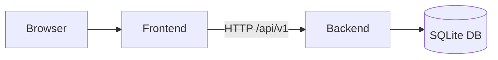

# Pesa Cup

A full-stack web platform for managing and displaying a football tournament of Prabhat Ex-Batch Association Cup — fixtures, standings, top scorers, gallery, and contact.

## Repositories

| Service | README |
|---------|--------|
| Frontend (React + Vite) | [frontend/README.md](./frontend/README.md) |
| Backend (Bun + Express + SQLite) | [backend/README.md](./backend/README.md) |

## Architecture

```
pesa_cup/
├── frontend/    # React 19 SPA served on port 5173
├── backend/     # Express REST API served on port 3000
├── data/        # Shared SQLite database file (mounted in Docker)
└── compose.yml  # Docker Compose for running both services
```



## Quick Start

### Option 1 — Docker Compose (recommended)

```bash
# Create env files first (see each service's README for variables)
cp backend/.env.example backend/.env
cp frontend/.env.example frontend/.env

docker compose up --build
```

| Service | URL |
|---------|-----|
| Frontend | http://localhost:5173 |
| Backend API | http://localhost:3000/api/v1 |

### Option 2 — Pixi (run both locally)

Requires [Pixi](https://pixi.sh/) and [Bun](https://bun.sh/).

```bash
# Install dependencies for both services
cd frontend && bun install && cd ..
cd backend  && bun install && cd ..

# Start frontend and backend concurrently
pixi run dev
```

### Option 3 — Manual

```bash
# Terminal 1 — backend
cd backend && bun run dev

# Terminal 2 — frontend
cd frontend && bun run dev
```

## TODO

- [ ] **S3 bucket integration** — migrate gallery image storage from local filesystem to an S3-compatible bucket (AWS S3 or MinIO)
- [ ] **Backend S3 config** — add `AWS_ACCESS_KEY_ID`, `AWS_SECRET_ACCESS_KEY`, `S3_BUCKET_NAME`, and `S3_ENDPOINT` to backend `.env` and update gallery upload/retrieval logic
- [ ] **Dockerize S3 storage** — add a [MinIO](https://min.io/) service to `compose.yml` as a local S3-compatible store for development
- [ ] **Update `compose.yml`** — wire the MinIO container to the backend via environment variables and a shared Docker network
- [ ] **Frontend image URLs** — update gallery components to read image URLs from S3/MinIO instead of relative paths

---

## API Overview

All endpoints are prefixed with `/api/v1`. See [backend/README.md](./backend/README.md) for the full endpoint table.

| Resource | Path |
|----------|------|
| Health | `/api/v1/health` |
| Fixtures | `/api/v1/fixtures` |
| Standings | `/api/v1/standings` |
| Scorers | `/api/v1/scorers` |
| Gallery | `/api/v1/gallery` |
| Contact | `/api/v1/contacts` |
| Tournament | `/api/v1/tournament` |
